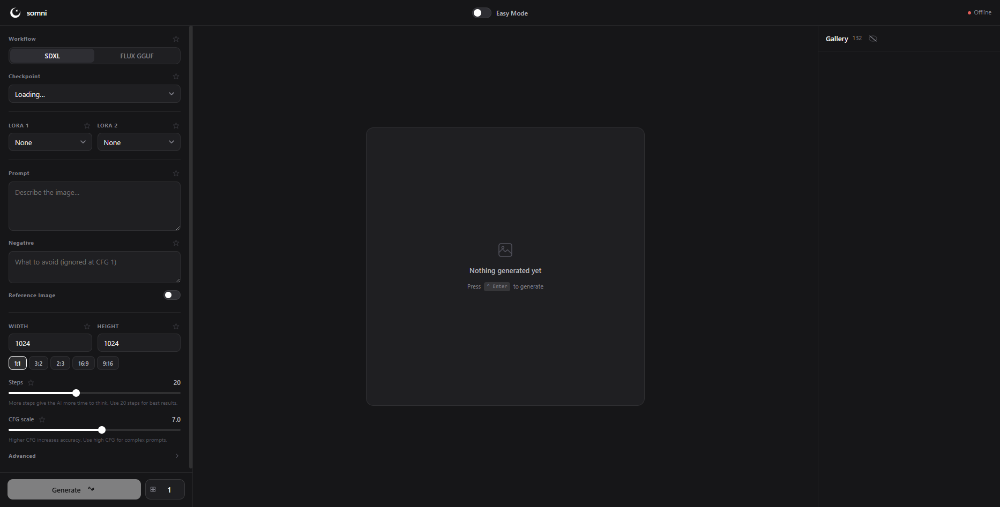
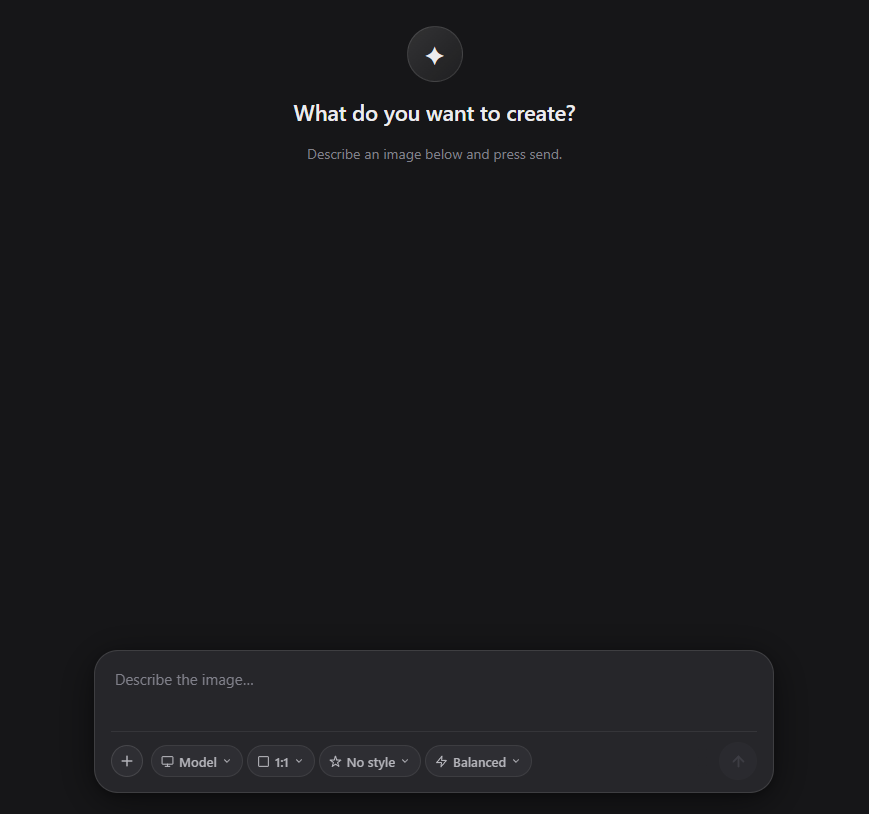

<div align="center">

# Try [**somni Cloud**](https://aethelian.eu/pages/szearcc/somni-comfyui/cloud) now!

</div>

<div align="center">
  

  # somni

  **A modern frontend for ComfyUI. Gemini-style easy mode, IP-Adapter support, and built for both desktop and mobile.**

  <sub>[Try it now](https://github.com/searcc/somni-comfyui/releases/latest) and you'll forget you're using ComfyUI.</sub>
  
  
</div>

---

## ✦ What is it

somni is a polished, opinionated frontend that runs alongside your existing ComfyUI install. It talks to ComfyUI over HTTP: your workflows, models, and outputs stay exactly where they are.

**Available in three versions:**
- **Web UI** - Run locally on your machine, connects to your ComfyUI installation
- **Desktop Application** - Native Windows app with embedded browser, first-run configuration
- **Cloud** - Hosted version with no complicated setup **at all** (try it at the top of this page)

- **Easy mode**: a chat-style interface (think Gemini / ChatGPT) for one-prompt-and-go generation
<div align="center">
  
</div>

- **Pro mode**: full sidebar with sampler, scheduler, seed, LoRAs, CFG, advanced options
- **Reference image (IP-Adapter)**: General · Face · FaceID modes with a denoising slider
- **Batch generation**: generate N images, displayed in a scrollable preview
- **Gallery** with full-screen viewer, swipe-to-navigate on mobile, arrow buttons on desktop
- **Favorites**: star any option and its value persists across reloads
- **Mobile-first design**: phone-friendly bottom bar, swipe gestures, tap targets sized properly
- **Smooth animations** everywhere: toggles spring, popovers pop, gallery items stagger in
- **No background services**: runs as a single Python script when you want it, closes when you don't

---

## ✦ Installation

### Requirements

- **ComfyUI** already installed and working ([download here](https://github.com/Comfy-Org/ComfyUI))
- **Python 3.x** in your PATH (for Web UI; Desktop app configures this during first run)
- **Windows** (the launch scripts are `.bat` files; Linux/macOS support is on the roadmap)

### Steps (Web UI)

1. **Download** the latest [release zip](../../releases/latest) and extract it anywhere
2. **Run `installer.bat`**. Your browser opens to `http://localhost:8081`
3. **Walk through the 4 steps:**
   - Point to your ComfyUI folder
   - Pick how you launch its Python (portable / venv / system)
   - Choose where to install somni (defaults to `<ComfyUI>\somni`)
   - Tick the "open browser on launch" option
4. **Click Install** — somni copies its files and writes two launch scripts
5. **Done.** Run `launch_comfyui_and_somni.bat` (or `launch_somni.bat` if ComfyUI is already running)

That's it. somni opens in your browser at `http://localhost:8080`.

### Steps (Desktop Application) v1.2.0 and higher

1. **Download** the latest [Windows EXE](../../releases/latest)
2. **Execute the file**. A setup wizard should open
3. **Choose somni install path** in the window and wait for somni to install
4. **Launch `somni.exe`**. On first run, a configuration dialog will appear:
   - Point to your ComfyUI folder
   - Pick how you launch its Python (portable / venv / system)
   - Optionally create a launch script
5. **Done.** somni opens and connects to your ComfyUI

### Steps (Desktop Application) v1.1.1 and lower

1. **Download** the latest [Windows release zip](../../releases/latest) and extract it anywhere
2. **Run `installer.exe`**. An installer window should open
3. **Walk through the 3 steps:**
   - Point to your ComfyUI folder
   - Pick how you launch its Python (portable / venv / system)
   - Choose where to install somni (defaults to `<ComfyUI>\somni`)
4. **Click Install** — somni copies its files and writes a `somni.exe` file
5. **Done.** Launch `somni.exe`

---

## ✦ Using somni from your phone

The launch script binds to `0.0.0.0`, so any device on your Wi-Fi can reach it.

1. Find your PC's local IP (`ipconfig` → look for `IPv4 Address`, usually `192.168.x.x`)
2. On your phone, open `http://<that-ip>:8080`
3. Generate images from the couch

**Note:** For the desktop application, you can also access somni from your phone by using your PC's local IP address in the browser.

---

## ✦ Reference image (IP-Adapter)

Three modes, three workflows. Each needs specific model files in your ComfyUI install. somni's UI tells you which one is active, but **the models are on you to download**:

| Mode | Needs |
|---|---|
| **General** | `ip-adapter-plus_sdxl_vit-h.safetensors` in `ComfyUI/models/ipadapter/` |
| **Face** | `ip-adapter-plus-face_sdxl_vit-h.safetensors` in `ComfyUI/models/ipadapter/` |
| **FaceID** | `ip-adapter-faceid-plusv2_sdxl.bin` in `ipadapter/`, matching LoRA in `loras/`, plus `pip install insightface onnxruntime` |

All three modes also need:
- `CLIP-ViT-H-14-laion2B-s32B-b79K.safetensors` in `ComfyUI/models/clip_vision/`
- The [ComfyUI_IPAdapter_plus](https://github.com/cubiq/ComfyUI_IPAdapter_plus) custom node (install via ComfyUI Manager)

Easiest path: open **ComfyUI Manager → Install Models**, search for "ipadapter". Pick what you want.

---

## ✦ Something went wrong?

### Web UI

If somni won't launch:

- **Re-run `installer.bat`** — this won't touch your images or settings, it just regenerates the launch scripts
- **Check the terminal output** when running `launch_somni.bat`. Python errors get printed there
- **Port conflict?** Something else on `:8080` (full ComfyUI desktop app?) close it first
- **MS Store Python stub** intercepting `python`: the installer handles this, but if it slipped through: `Settings → Apps → Advanced app settings → App execution aliases` → turn off the `python.exe` toggles

### Desktop Application

If the desktop app won't launch or connect:

- **Re-run the configuration** — Delete `somni_config.json` from the installation directory and relaunch `somni.exe` to reconfigure
- **Check the console output** — The Electron app shows Python errors in the console
- **Port conflict?** Something else on `:8080` (full ComfyUI desktop app?) close it first
- **ComfyUI not running?** The desktop app expects ComfyUI to be running. Start ComfyUI first, or use the optional launch script created during configuration

If you find a bug or want a feature, [open an issue](../../issues).

---

## ✦ How it works

### Web UI

```
┌──────────────┐    HTTP/WS     ┌──────────────────┐
│  Your browser│  ───────────▶  │  somni server.py │
└──────────────┘                │  (port 8080)     │
                                └────────┬─────────┘
                                         │  proxies + serves index.html
                                         ▼
                                ┌──────────────────┐
                                │     ComfyUI      │
                                │  (port 8188)     │
                                └──────────────────┘
```

`server.py` is a tiny Python proxy (~200 lines, stdlib only). It serves `index.html` and forwards everything else to ComfyUI, stripping `Origin`/`Referer` headers so ComfyUI's loopback host-check passes. It also adds two endpoints: `/__list` for gallery thumbnails and `/__delete` for delete buttons because vanilla ComfyUI doesn't expose them.

### Desktop Application

The desktop application (somni.exe) is an Electron app that bundles `server.py` and the web UI. On first launch, it shows a configuration dialog to connect to your ComfyUI installation. The app spawns `server.py` as a child process and loads the web UI in an embedded browser window.

The entire UI is one HTML file. No build step. No npm. No bundler. Open the source and you can change anything.

---

## ✦ Roadmap

- Multi-image reference (IP-Adapter combine mode)
- Inpainting

---

## ✦ License

MIT (see [LICENSE](LICENSE)). Do whatever you want, just don't blame me.

---

<div align="center">
  <sub>Built on top of <a href="https://github.com/comfyanonymous/ComfyUI">ComfyUI</a></sub>
</div>
